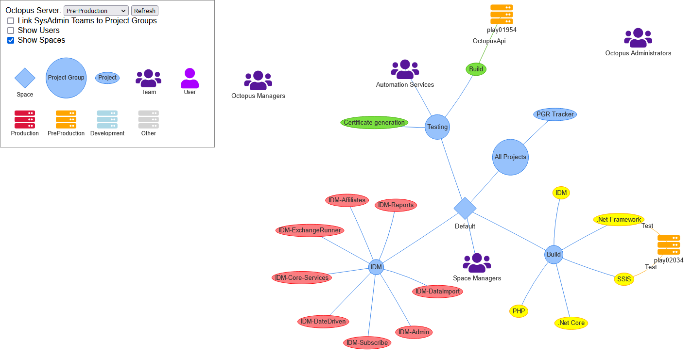

# OctoGraph

A simple ASP.NET tool to visualise [Octopus Deploy](https://octopus.com/) instances using the [vis.js](https://visjs.org/) Network visualization.

## Rationale

This was created as a tool to help us re-organise our Octopus Deploy environments between our various teams and applications, especially with respect to our licencing restriction (number of targets), and to see who required access to what.

Also, the diagram ends up kinda looking like an octopus. Which is nice.

## Quick Setup

OctoGraph is a ASP.NET Core application targetting .NET 6.0, which can be hosted in any of the [usual ways](https://learn.microsoft.com/en-us/aspnet/core/host-and-deploy), or simply run locally.
Before running it for the first time you will need to:

1. In appsettings.json set the OctopusInstances to the Octopus servers you wish to visualise. You'll need an [API Key](https://octopus.com/docs/octopus-rest-api/how-to-create-an-api-key) for each instance, that has full read permission over all Spaces, Environments, Project Groups, Projects, Teams, and Users.
1. For anonymous access, leave AuthenticationEnabled set to false. To require authentication, set it to true and set up the AzureAd section values to an appropriate app registration on your Azure tenancy.

## How to Use

Once the application is running within your hosting environment, open a browser to the root of the site and select the desired Octopus Instance from the drop-down menu to load it. This can take a while (~30s) for a large setup. Subsequent loads are cached on the server, according to the CacheTimeoutInMinutes setting. Clicking the "Refresh" button will refresh the cache and reload the graph. 
Double-clicking a node on the diagram will attempt to deep-link you to the appropriate object within Octopus.
